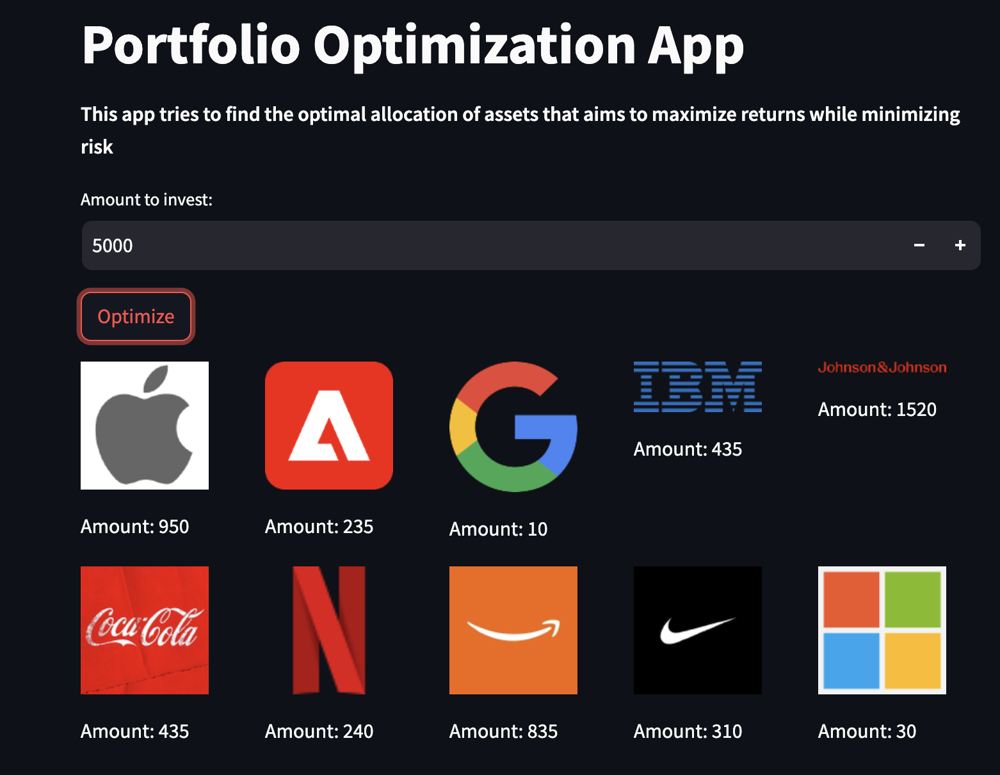
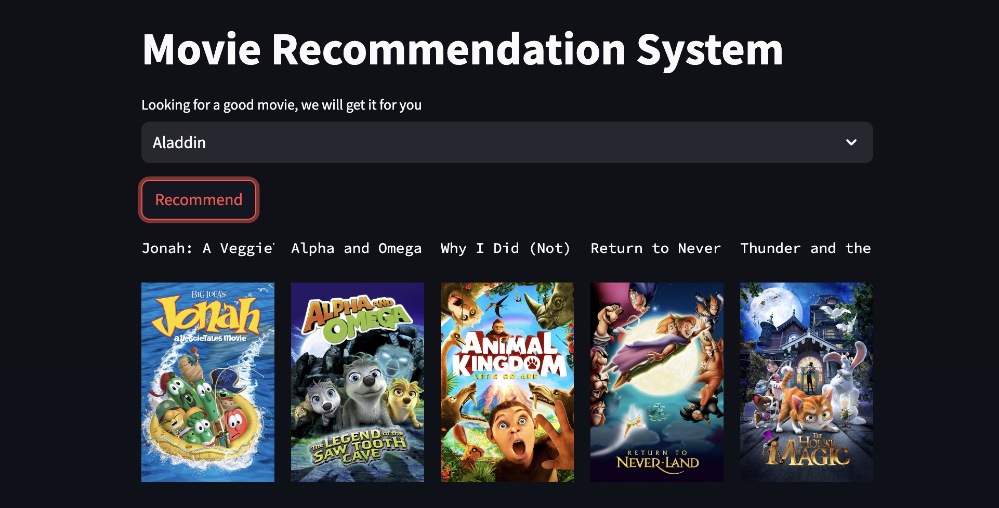
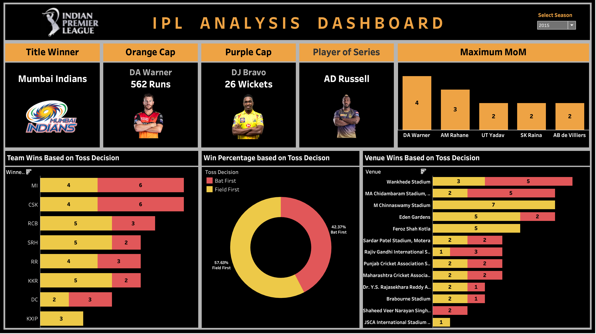

# Data Science and Analytics

## Project 1: Financial Complaints Dashboard
* abc
* def
* ghi
  
  

## Project 2: [Portfolio Optimization](https://github.com/VIDIT-9/Portfolio-Optimization)
Implemented a algorithm to find the optimal allocation of assets that aims to maximize returns while minimizing risk.
* Gathered real-time data of multiple stocks prices starting from FY'22 using python library to access Yahoo Finance API.
* Calculated Sharpe Ratio which compares the return with risk using Expected Portfolio Returns and Volatility.
* Employed Monte Carlo algorithm as it is suitable for risk assessment, risk management and decision analysis.
* Implemented an optimization algorithm, Sequential Least Square Programming(SLSQP) using scipy.optimization

     

## Project 3: [Movies Recommendation System](https://github.com/VIDIT-9/Recommender-System-TMDB-dataset)
Developed content based recommendation system that provides movie suggestions based on user preferences.
* Merged two datasets of 4800 movies and dug out suitable features for our system and performed Data Preprocessing.
* Combined all important features (genres/keywords/actors/directors) into one column and converted them into vectors.
* Model was trained to find top-5 similar movies on the basis of distances between each vectors using Cosine similarity.
* Created a basic Web application with user-friendly interface for enhanced user interaction using Streamlit.

  
   

## Project 4: [Data Analysis on IPL](https://github.com/VIDIT-9/Sparks-foundation-internship)
Conducted Data Analysis on IPL matches to derive actionable insights and trends, contributing to strategic decision-making
* Performed Exploratory Data Analysis on Indian Premier League dataset containing 1.8 lakh records of each delivery.
* Identified out Most Valuable Players and Teams a company should endorse for their products to increase their sales.
* Identified key factors like toss results and fielding potential should be considered as they had impacts on match results
  
  
   

